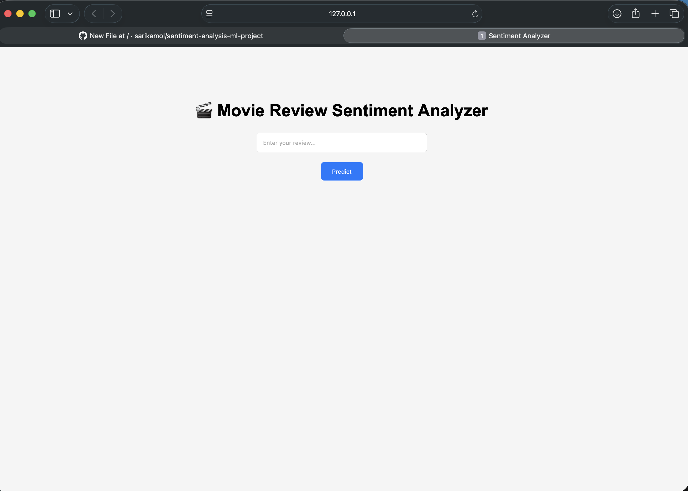
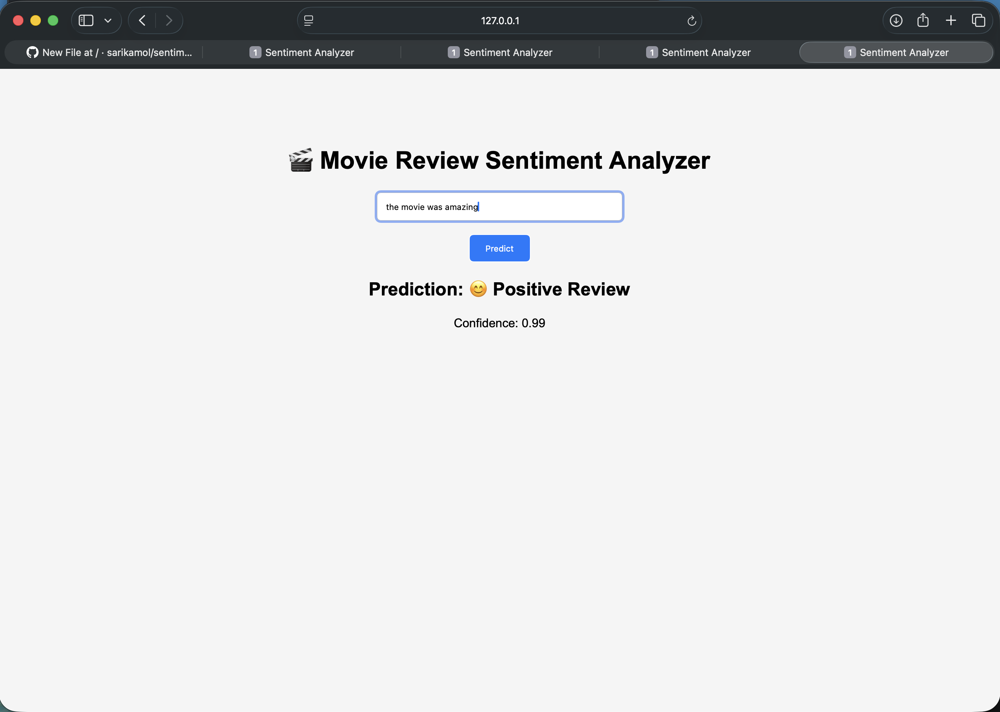
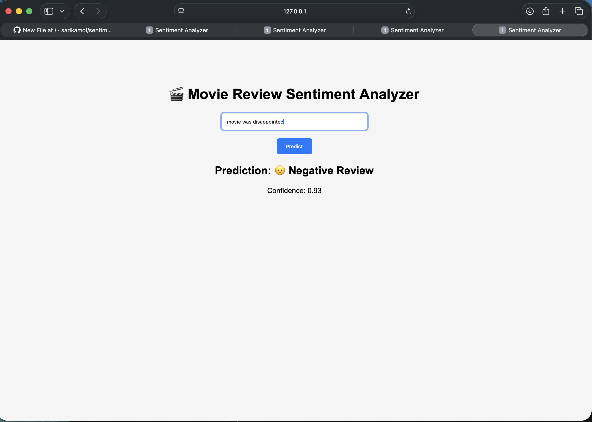

# 🎬 Sentiment Analysis Web App (IMDb Dataset)

## 📌 Project Overview
This project is a Machine Learning-based web application that analyzes the sentiment of movie reviews.  
It classifies user input as Positive or Negative using Natural Language Processing (NLP) techniques.

---

## 🚀 Features
- Real-time sentiment prediction  
- Trained on IMDb dataset (50,000 reviews)  
- Clean and simple web interface  
- Confidence score for predictions  
- End-to-end ML pipeline (data → model → deployment)

---

## 🧠 Tech Stack
- Python  
- scikit-learn  
- NLTK  
- Flask  
- HTML/CSS  

---

## 📊 Model Details
- Algorithm: Logistic Regression  
- Feature Extraction: TF-IDF Vectorizer  
- Dataset: IMDb Movie Reviews (50K samples)  
- Accuracy: ~88%  

---

## 📁 Project Structure
    sentiment-analysis/
    │
    ├── data/
    ├── templates/
    │   └── index.html
    ├── model.pkl
    ├── vectorizer.pkl
    ├── app.py
    ├── imdb_project.py
    ├── requirements.txt
    └── README.md
---

## ▶️ How to Run Locally

### 1. Clone repository
    git clone https://github.com/sarikamol/sentiment-analysis-ml-project.git 
    cd sentiment-analysis-ml-project

### 2. Create virtual environment
    python3 -m venv venv source venv/bin/activate

### 3. Install dependencies
    pip install -r requirements.txt

### 4. Run the app
    python app.py

### 5. Open in browser
    http://127.0.0.1:5000/

---

## 💡 Example

Input:

    This movie was amazing and fantastic

Output:

    Prediction: Positive
    Confidence: 0.92

---
## 📸 Web App Screenshots

### UI View

### Input & Prediction Result 1

### Input & Prediction Result 2

---

## 🎯 Future Improvements
- Deploy on cloud (AWS / Render)  
- Add deep learning models (LSTM / BERT)  
- Improve UI design  
- Add API endpoints  

---

## 👩‍💻 Author
Sarika mol 
Machine Learning Enthusia
